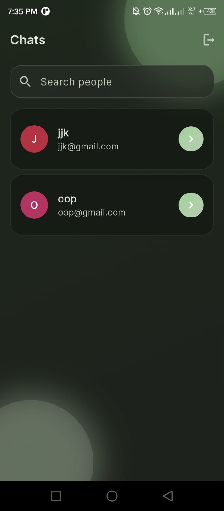

# Flutter Firebase Chat (Glass UI)

A modern, glassmorphism-styled 1:1 chat app built with Flutter and Firebase. Includes Email/Password + Google sign-in, a people list, and real-time messaging powered by Cloud Firestore. Beautiful gradient backgrounds, frosted cards, hero transitions, date chips, and polished message bubbles.

Status: Chat-only (no audio/video calling)

---

## ✨ Features

- Firebase Authentication
  - Email/Password
  - Google provider (mobile + web)
- Real-time 1:1 chat with Cloud Firestore
- Clean Material 3 theme with glass/gradient accents
- Search people, hero avatar transitions, animated background blobs
- Date separators and timestamps in chat
- Secure Firestore rules for private chats

Planned enhancements:
- Image/file messages (Firebase Storage)
- Read receipts, typing indicators, presence
- Push notifications (FCM)

---

## 🧰 Tech stack

- Flutter 3.27.1
- Firebase Auth, Cloud Firestore
- Provider (state management)
- Google Fonts, intl

---

## 🖼️ Screens

- Sign In / Register (gradient + frosted “glass” UI)
- Home (People list with search, hero avatars/blobs)
- Chat (date chips, gradient bubbles, timestamps)

| Sign In Page | Register Page | Home Screen | Chat Screen |
|------------|-----------------|------------|-----------------|
|  |  |  | 